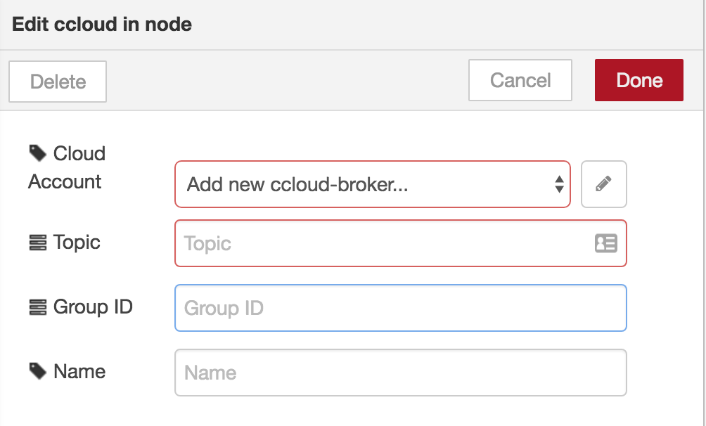
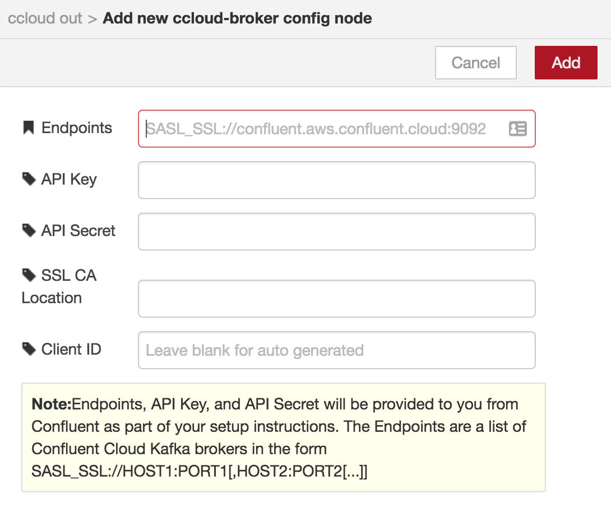

node-red-contrib-ccloud
========================

Node-RED (http://nodered.org) nodes for publish/subscribe messaging using the Confluent Cloud Apache Kafka as a service offering.

# Features

* Up to date support for Confluent Cloud - Apache Kafka as a Service (see https://www.confluent.io/confluent-cloud/)
* High performance through use of librdkafka C/C++ library ( see https://github.com/edenhill/librdkafka) 
* Up to date feature set from use of node-rdkafka node.js client (see https://github.com/Blizzard/node-rdkafka)
* Tested on Linux (Ubuntu and Centos), macOS, and Raspberry Pi (Raspbian Jessie)
* Supports dynamic topic selection via incoming msg.topic value
* Supports dynamic partition selection via incoming msg.partition value
* Supports event time timestamps (with Kafka 0.10+) via msg/timestamp value
* Uses `auto.offset.commit` to commit consumers offsets 

# Dependencies

In addition to node.js and node-red each platform has the following dependancies:

Linux dependencies

* openssl
* libssl-dev
* libsasl2-dev
* libsasl2-modules
* C/C++ compiler

macOS dependencies

* Apple Xcode command line tools (for the compiler)
* openssl installed via Brew (needed for root certs file in `/usr/local/etc/openssl/cert.pem`)
* Export CPPFLAGS=-I/usr/local/opt/openssl/include and LDFLAGS=-L/usr/local/opt/openssl/lib

# Install

Node.JS and Node-Red must already be installed ( see http://nodered.org/docs/getting-started/installation.html)

Install node-red-contrib-ccloud from github sources on macOS
	
	brew install openssl
	export CPPFLAGS=-I/usr/local/opt/openssl/include
	export LDFLAGS=-L/usr/local/opt/openssl/lib
	cd /tmp	
	git clone git@github.com:confluentinc/node-red-contrib-ccloud.git
	cd ~/.node-red	
	sudo -E npm install /tmp/node-red-contrib-ccloud

Install node-red-contrib-ccloud from npm on macOS

	brew install openssl
	export CPPFLAGS=-I/usr/local/opt/openssl/include
	export LDFLAGS=-L/usr/local/opt/openssl/lib
	cd ~/.node-red
	sudo -E npm install node-red-contrib-ccloud

Install node-red-contrib-ccloud from source on Ubuntu

	sudo apt install nodejs-legacy
	sudo apt install openssl libssl-dev libsasl2-dev libsasl2-modules
	cd /tmp	
	git clone git@github.com:confluentinc/node-red-contrib-ccloud.git
	cd ~/.node-red	
	npm install /tmp/node-red-contrib-ccloud
	
You may see a lot of warnings as librdkafka compiles and installs, particularily about sasl on macOS but it does work.

Start node-red as normal or with `-v` for better debugging

	node-red -v

Point your browser to http://localhost:1880

You should see ccloud input and output nodes in the pallet on the left side of the screen.
<ul>
    
    
</ul>

Drag either ccloud node to the canvas and double click to configure the topic, brokers, clientID and groupID.

Click on the pencil icon to the right of the broker selection box to configure a kafka broker connection if one does not already exist.

Publish and subscribe just as you would with the mqtt node with some small differences namely:
<ul>
	<li>topics should not contain "/" or "." characters
	<li>kafka wildcard/regex subscriptions are not yet fully tested
	<li>ensure you have unique Group IDs configured unless you want multiple consumers to be in a Kafka consumer group
</ul>

# Troubleshooting

If you see the following error when you run a producer or consumer, it means you have not installed and linked librdkafka correctly with the required SSL and SASL libraries. See install instructions for installing openssl, setting compiler flags, and on MacOS adding the -E option to sudo so the environment variable are preserved.

	Caught error: Error: Invalid value for configuration property "security.protocol"
	
The default SSL Certificate location is `/usr/local/etc/openssl/cert.pem` which works on macOS, if you follow the install instructions, but every flavor of Linux puts root certificates in different places. Make sure to configure the SSL CA Location as follows for your target platform:

	Ubuntu/Debian/Raspbian: /etc/ssl/certs
	CentOS/RedHat: /etc/pki/tls/cert.pem
	macOS: /usr/local/etc/openssl/cert.pem (from `brew install openssl`)

# Author

Hans Jespersen, https://github.com/hjespers

# Feedback and Support

For more information, feedback, or support see https://github.com/confluentinc/node-red-contrib-ccloud/issues
